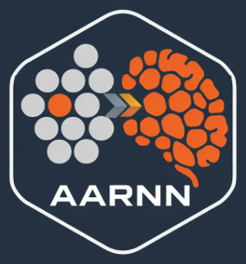

# Tracey Swarm Security


Tracey is a swarm-style, self-learning monitoring and response system. It coordinates multiple agents to score events, reach consensus, and optionally trigger containment actions.
Tracey runs on a non-blocking, multi-threaded async runtime and uses all available CPU cores.

## Architecture

- Sensors generate events and publish them to a shared event bus.
- Agents subscribe to the bus, score events using adaptive baselines, and send assessments.
- The coordinator aggregates assessments, applies policy thresholds, and issues decisions.
- Learning snapshots are broadcast so agents continuously adapt as conditions change.
- Discovery uses authenticated gossip to detect peer agents on the local network.
- Asset feeds let you report unmanaged hosts from approved telemetry sources (DHCP, DNS, NetFlow, CMDB, etc.).
- Inventory correlates asset observations with agent presence to flag unmanaged hosts.
- Optional adaptive tuning keeps alert volumes stable without ML models.
- Optional OTA updates let the agent switchover to new code safely (signed bundles + handoff).
- Optional mTLS update delivery pulls signed bundles from a secured update service.
- Optional supervisor mode restarts the agent automatically on crash or update.
- Optional telemetry integration scrapes local Prometheus/OTel metrics endpoints and feeds them into the swarm.
- Optional embedded collectors read `/proc` and `/sys` for CPU, memory, thermal, disk, and network signals, with Jetson add-ons when available.

## Key Modules

- `src/sensors.rs` simulates system, network, user, and automation signals.
- `src/swarm/agent.rs` scores events and produces assessments.
- `src/swarm/coordinator.rs` enforces consensus and response policy.
- `src/swarm/learning.rs` maintains online stats and merges baselines.
- `src/discovery.rs` authenticates agent presence via UDP gossip.
- `src/embedded.rs` gathers local embedded metrics from `/proc` and `/sys`.
- `src/assets.rs` ingests external asset observations (JSONL feed).
- `src/storage.rs` writes JSONL records for events, decisions, learning snapshots, and inventory.

## Running

```bash
cargo run
```

Tracey writes JSONL records to `tracey.log.jsonl` by default.

## Configuration

Set `TRACEY_CONFIG` to a JSON config file path.

Example:

```json
{
  "agent_id": "tracey-prod-01",
  "agents": 8,
  "event_rate_ms": 120,
  "assessment_quorum": 5,
  "decision_threshold": 0.72,
  "active_response": false,
  "shutdown_enabled": false,
  "discovery": {
    "enabled": true,
    "bind_addr": "0.0.0.0:47990",
    "broadcast_addr": "255.255.255.255:47990",
    "shared_key": "rotate-this-key",
    "announce_interval_ms": 1500,
    "ttl_ms": 10000
  },
  "asset_feed": {
    "enabled": true,
    "path": "asset_feed.jsonl",
    "poll_interval_ms": 3000,
    "source": "cmdb"
  },
  "inventory": {
    "agent_ttl_ms": 30000,
    "host_ttl_ms": 120000,
    "unmanaged_resend_ms": 30000
  },
  "tuning": {
    "enabled": true,
    "target_alert_rate": 0.08,
    "adjustment_rate": 0.05,
    "min_threshold": 0.55,
    "max_threshold": 0.95,
    "window_ms": 10000
  },
  "update": {
    "enabled": true,
    "update_dir": "updates",
    "bundle_name": "tracey.update",
    "signature_name": "tracey.update.sig",
    "metadata_name": "tracey.update.meta.json",
    "shared_key": "rotate-this-key",
    "poll_interval_ms": 5000,
    "handoff_timeout_ms": 10000,
    "remote": {
      "enabled": true,
      "base_url": "https://updates.example.com/tracey",
      "metadata_path": "tracey.update.meta.json",
      "bundle_path": "tracey.update",
      "signature_path": "tracey.update.sig",
      "ca_cert_path": "certs/ca.pem",
      "client_identity_path": "certs/client.pem",
      "timeout_ms": 8000
    }
  },
  "telemetry": {
    "enabled": true,
    "prometheus_enabled": true,
    "endpoints": ["http://127.0.0.1:9100/metrics"],
    "scrape_interval_ms": 5000,
    "max_samples": 200,
    "allow_prefixes": ["process_", "node_", "system_", "cpu", "mem", "load", "http_", "otelcol_"],
    "allow_exact": [],
    "autodiscover_local": true,
    "allow_remote": false,
    "source": "telemetry",
    "timeout_ms": 2000,
    "prefer_prometheus": true,
    "dedup_ttl_ms": 30000,
    "otlp": {
      "enabled": true,
      "grpc_addr": "127.0.0.1:4317",
      "http_addr": "127.0.0.1:4318",
      "enable_grpc": true,
      "enable_http": true
    }
  },
  "embedded": {
    "enabled": true,
    "interval_ms": 2000,
    "jetson_enabled": true,
    "max_thermals": 8,
    "max_disks": 8,
    "max_interfaces": 8,
    "process_enabled": true,
    "process_top_n": 5,
    "process_window_ms": 5000,
    "process_max": 2048,
    "gpu_enabled": true,
    "gpu_sysfs_enabled": true,
    "gpu_nvml_enabled": true,
    "gpu_rocm_enabled": true,
    "gpu_max_devices": 8
  },
  "governance": {
    "enabled": true,
    "vote_interval_ms": 1500,
    "vote_ttl_ms": 5000,
    "quorum": 3,
    "decision_threshold": 0.6,
    "min_confidence": 0.5,
    "relaxed_risk": 0.2,
    "strict_risk": 0.7,
    "lockdown_risk": 0.9,
    "rebel": {
      "enabled": true,
      "probability": 0.03,
      "max_streak": 2,
      "cooldown_ms": 10000
    }
  },
  "coordination": {
    "enabled": true,
    "max_coordinators": 2,
    "election_interval_ms": 1000,
    "presence_ttl_ms": 8000,
    "weight_cpu": 1.0,
    "weight_latency": 1.5,
    "weight_hash": 0.1,
    "weight_capability": 0.5
  },
  "status": {
    "enabled": true,
    "listen_addr": "0.0.0.0:48000",
    "public_addr": "10.0.0.10:48000",
    "proxy_timeout_ms": 1500
  },
  "auth": {
    "mode": "oidc",
    "protect_status": true,
    "protect_otlp_http": true,
    "protect_otlp_grpc": false,
    "oidc": {
      "issuer": "https://auth.neuralmimicry.ai",
      "jwks_url": null,
      "client_id": "tracey",
      "audiences": ["tracey"],
      "required_scopes": ["tracey:read"],
      "cache_ttl_ms": 60000,
      "leeway_sec": 60,
      "http_timeout_ms": 3000
    }
  },
  "stimuli": {
    "enabled": true,
    "listen_addr": "0.0.0.0:48100",
    "peer_addr": "10.0.0.20:48101",
    "flush_interval_ms": 500,
    "posture_interval_ms": 2000,
    "max_batch": 128,
    "max_packet_bytes": 8192
  },
  "storage": {
    "log_path": "tracey.log.jsonl"
  }
}
```

### Asset Feed Format (JSONL)

Each line is a JSON object with optional fields:

```json
{"host_id":"router-01","ip":"10.0.0.1","mac":"00:11:22:33:44:55","hostname":"router-01","os":"network-os","source":"cmdb"}
```

For unmanaged detection, set `agent_id` to match the `host_id` used in your asset feeds.

## OTA Update Bundle (Safe Handoff)

Place the following files into `update_dir`:

- `tracey.update` (new agent binary for this OS/arch)
- `tracey.update.meta.json` (metadata)
- `tracey.update.sig` (signature over metadata + binary)

Metadata format:

```json
{
  "version": "0.2.0",
  "os": "linux",
  "arch": "x86_64",
  "blake3": "<hex of blake3(binary)>"
}
```

Signature is a keyed blake3 hash over `metadata_bytes || binary_bytes` using `shared_key`.

Handoff: the old process spawns the new binary, waits for readiness, then shuts down.

### mTLS Remote Delivery

When `update.remote.enabled` is true, Tracey downloads the bundle/metadata/signature over HTTPS with mTLS. The files are still verified locally before any switchover.

### Sign Updates Offline

```bash
tracey sign-update --bundle ./tracey-new --version 0.2.0 --os linux --arch x86_64 --out updates --key "<shared_key>"
```

This produces `tracey.update`, `tracey.update.meta.json`, and `tracey.update.sig` in `updates/`.

### Supervisor Mode

Run Tracey with `--supervisor` to enable a lightweight watchdog that restarts the agent if it exits. In supervisor mode, OTA updates use a zero-downtime handoff: the supervisor starts the new binary, waits for readiness, then shuts down the old process.

### Telemetry Integration (Prometheus + OTLP)

If your host exposes Prometheus-style metrics (including many OTel Collector setups), enable `telemetry` and provide endpoints. By default, Tracey will autodiscover common local endpoints when enabled and will only scrape loopback addresses unless `allow_remote` is true.

For OTLP-native ingest, enable `telemetry.otlp` and point your OTel SDK/collector exporter to `grpc_addr` or `http_addr` on the Tracey host. When both Prometheus and OTLP metrics are present, Tracey prefers Prometheus and de-duplicates OTLP samples within `dedup_ttl_ms` using attribute-based keys (metric name + labels/attributes) to keep overhead minimal.

### Governance (Swarm-Driven Rules)

When `governance.enabled` is true, swarm agents vote on a shared operational posture (relaxed/balanced/strict/lockdown) and the coordinator enforces rule changes accordingly. This drives dynamic enforcement of key settings such as `active_response`, `shutdown_enabled`, update gating, and telemetry controls. The decisions are logged as `governance_update` records.

Optional `governance.rebel` introduces rare contrarian votes (bounded by probability and cooldown) to simulate byzantine behavior and keep the consensus process robust over time.

### Coordinator Election + Split Brain + Load Sharing

The coordinator role is elected across agents using weighted scoring (capabilities + observed latency + hash tie‑breaks). If partitions occur, each partition will elect its own coordinators (split brain). When connectivity is restored, all agents converge on the same top‑K coordinators and non‑leaders step down automatically.

The score includes a hash component (shared discovery key + `agent_id`) to provide deterministic tie‑breaks.

With `max_coordinators > 1`, leaders load‑share by deterministically partitioning events across the top‑K coordinators.

The swarm also tracks a lowest‑latency proxy (preferably among current coordinators) to service external status queries.

### Status RPC (Proxied)

Tracey exposes a lightweight status endpoint. Requests to any agent are proxied to the elected lowest‑latency proxy, with a local fallback if the proxy is unreachable.

```bash
curl http://agent-host:48000/status
```

Set `status.public_addr` when the listen address is not routable (for example, `0.0.0.0` or a private bind).

### OIDC Auth (Status + OTLP)

Tracey can enforce OIDC bearer tokens on `/status` and OTLP ingest endpoints. Enable via config or environment variables:

- `NM_AUTH_MODE=oidc` (or `TRACEY_AUTH_MODE=oidc`)
- `NM_OIDC_ISSUER`, `NM_OIDC_JWKS_URL` (optional), `NM_OIDC_CLIENT_ID`
- `NM_OIDC_ALLOWED_AUDIENCES` or `NM_OIDC_AUDIENCE`
- `NM_OIDC_REQUIRED_SCOPES`
- `NM_OIDC_PROTECT_STATUS=1`, `NM_OIDC_PROTECT_OTLP_HTTP=1`, `NM_OIDC_PROTECT_OTLP_GRPC=1`

### AER Stimuli Bridge (Tracey <-> AARNN)

Tracey can exchange spiking stimuli with AARNN using Address-Event Representation (AER) over UDP. It encodes swarm events as AER spikes and can ingest AER spikes from AARNN as observability events.

Default address ranges:
- Tracey event spikes: base `0x1000` with kind/severity strides.
- Tracey posture spikes: base `0x1100` (relaxed/balanced/strict/lockdown).
- AARNN output spikes (ingest): base `0x4000`.

Use matching base values on AARNN so both sides interpret addresses consistently.

## Safety Notes

Tracey does not self-propagate or probe exploits. Use approved deployment channels (MDM, SSH, GPO, package managers) and authorized telemetry sources.

To enable active response, set `active_response` and wire actions to your own containment pipeline.

## Tracey is enabled by:
 
