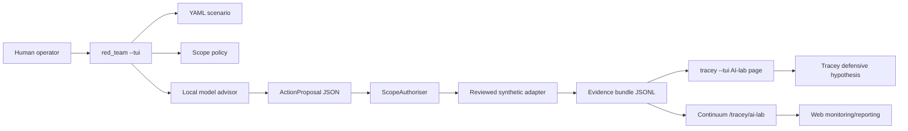

# AI Lab Emulation

This implementation turns the slide-deck question into an authorised lab experiment:

Use locally hosted AI to accelerate hypothesis generation, bounded action selection, and evidence production in an isolated test network, while Tracey and Continuum measure what was visible and what response was proposed.

It does not add a general-purpose attack tool. The model boundary is typed JSON only, and execution is limited to reviewed synthetic adapters.

## Architecture



## Trust Boundaries

- `red_team` may propose only `ControlledAction` values.
- The local model has no shell, no public target discovery, and no ability to change scope.
- `ScopePolicy` denies public addresses, default routes, unlisted hosts, unsupported actions, missing lab tokens, missing snapshots, rate-limit violations, and kill-switch state.
- Adapters emit synthetic evidence records. They do not run exploit payloads, harvest credentials, persist access, or move real data.
- Medium-risk lab actions require explicit `--approve-medium`; high-risk actions are prohibited by default.

## Setup

1. Isolate the lab network. The included policy expects `10.77.0.0/24`.
2. Start Tracey with AI-lab status enabled:

```bash
TRACEY_AI_LAB_ENABLED=true \
TRACEY_AI_LAB_TOKEN=demo-lab-token \
cargo run --bin tracey
```

3. Open the local Tracey dashboard:

```bash
cargo run --bin tracey -- --tui --status http://127.0.0.1:48000
```

4. Start Continuum if you want web monitoring:

```bash
cd /home/pbisaacs/Developer/neuralmimicry/nmc/nmc_server
./build/nmc_server --port 8080
```

## Execute

Run the seeded credential and synthetic data staging scenario from `red_team`.

Dry-run mode is the default and records the full evidence bundle without executing even the synthetic adapter side effect. Use `--scenario-only` for deterministic headless evidence generation. Use `--tui` when an operator wants the local ratatui activity display.

```bash
cd /home/pbisaacs/Developer/neuralmimicry/red_team
TRACEY_AI_LAB_TOKEN=demo-lab-token \
cargo run -- --scenario-only \
  --scenario scenarios/seeded_credential_data_staging.yaml \
  --policy config/ai_lab_policy.yaml \
  --evidence-dir evidence
```

To allow medium-risk lab-only actions such as synthetic staging and transfer markers:

```bash
TRACEY_AI_LAB_TOKEN=demo-lab-token \
cargo run -- \
  --scenario-only \
  --scenario scenarios/seeded_credential_data_staging.yaml \
  --policy config/ai_lab_policy.yaml \
  --evidence-dir evidence \
  --approve-medium
```

To mark reviewed synthetic adapters as executed instead of dry-run validated:

```bash
TRACEY_AI_LAB_TOKEN=demo-lab-token \
cargo run -- \
  --scenario-only \
  --scenario scenarios/seeded_credential_data_staging.yaml \
  --policy config/ai_lab_policy.yaml \
  --evidence-dir evidence \
  --approve-medium \
  --execute-synthetic
```

To publish the final report to Continuum:

```bash
TRACEY_AI_LAB_TOKEN=demo-lab-token \
NMC_AUTH_TOKEN=continuum-token \
cargo run -- \
  --scenario-only \
  --scenario scenarios/seeded_credential_data_staging.yaml \
  --policy config/ai_lab_policy.yaml \
  --evidence-dir evidence \
  --continuum-url http://127.0.0.1:8080 \
  --continuum-token continuum-token
```

## Evidence

Each run writes:

```text
evidence/<scenario-id>/
├── scenario.yaml
├── policy.yaml
├── event-timeline.jsonl
├── offensive-actions.jsonl
├── defensive-actions.jsonl
├── policy-decisions.jsonl
├── model-interactions.jsonl
├── action-results.jsonl
├── evaluation.json
└── final-report.md
```

Tracey can display typed `security_event`, `action_proposal`, `action_decision`, and `action_result` records in `tracey --tui` when its log path points at a JSONL containing those records. Continuum stores posted summaries under `/tracey/ai-lab` and renders them on the Control Room page.

## Emergency Shutdown

Set the environment kill switch before starting either Rust process:

```bash
export TRACEY_AI_LAB_KILL_SWITCH=1
```

With the kill switch engaged, every policy authorisation fails closed with `kill switch engaged`. If a policy file sets `kill_switch_path`, creating that file has the same effect.

## Reporting

The final report answers:

- what the red-team advisor proposed;
- which actions policy allowed or denied;
- what synthetic observations were produced;
- whether deterministic Tracey correlation proposed a defensive response;
- where evidence was retained for replay.

Continuum’s `/tracey/ai-lab` response includes report counts, policy stops, action totals, event totals, and the latest bounded scenario records for web monitoring.
